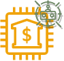

# Discord Wallet Tracker

[](https://github.com/ellerbrock/open-source-badges/)
[](https://opensource.org/licenses/MIT)

[](https://github.com/DerZwergGimli/SolanaWalletTracker/actions/workflows/main.yml)
 


This repo contains a Discord Wallet Tracker.

- Old version
  of this bot can be found
  here: [discord_solana_wallet_tracker (python)](https://github.com/DerZwergGimli/discord_solana_wallet_tracker)

## Features

- Easy to SetUp with Docker and Environment Variables.
- Sets his "Nickname" according to the provided Wallet-Balance,
- Posts all SPL-Transactions into a Channel.
- Posts all USDC SPL-Transactions into a seperate Channel.
- Can answer to some basic commands.
- Bot Command "prefix"/(~) can be set via EnviromentVariables

## Commands

| command      | description                     |
|--------------|---------------------------------|
| ~help        | Shows a help-message            | 
| ~address     | Prints the wallet-address       | 
| ~domain      | Prints the wallet-domain        | 
| ~solscan     | Prints a link to solcan.io      | 
| ~solanaBeach | Prints a link to solanabeach.io | 
| ~step        | Prints a link to step.finance   |
| ~tokens      | Prints a list of tokens         |

## Environment Variables

```
BOT_PREFIX=~
DISCORD_TOKEN=<PLACE-YOUR-DISCORD-TOKEN>
LOOP_UPDATENAME_SLEEP=60
LOOP_UPDATETX_SLEEP=5 
RUST_LOG=error 
TRANSACTION_CHANNEL_ID=<PLACE-YOUR-DISCORD-CHANNEL-ID>
TRANSACTION_USDC_CHANNEL_ID=<PLACE-YOUR-OTHER-DISCORD-CHANNEL-ID>
WALLET_ADDRESS=<PLACE_YOUR-SOLANA-WALLET-ADDRESS-HERE>
WALLET_ADDRESS_DOMAIN=<PLACE-YOUR-SOLANA-WALLET-DOMAIN-HERE>
```

## Development Links

- [QuickType](https://app.quicktype.io/) a generator for Types from JSON

## Donations

If you want to get me a ☕ so I won't 😴

- Solana-Wallet-Address: `BSW9zp3iJUcemTVWN4EThcaF6FxBQqP2wgnapSt1Z5mt`
- Solana-Wallet-Domain: `coffeeplease.sol    `